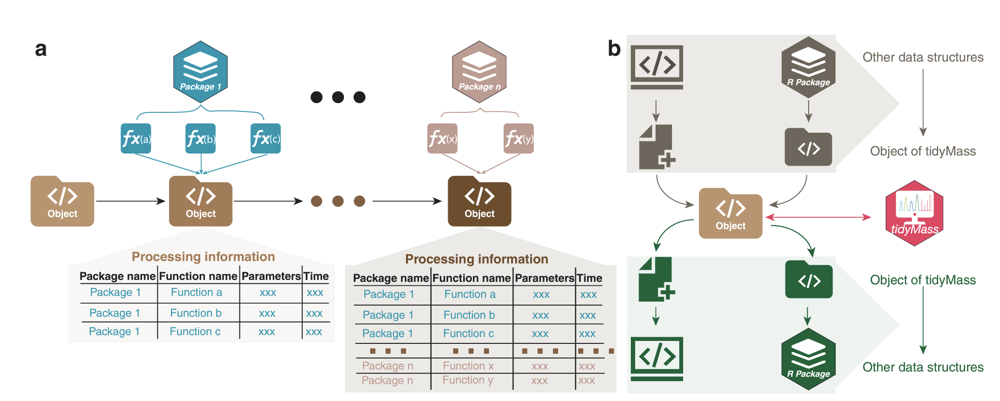
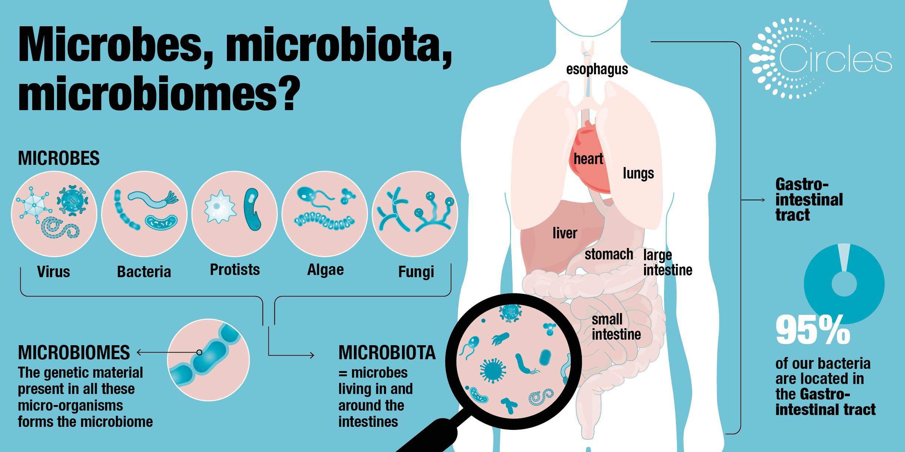
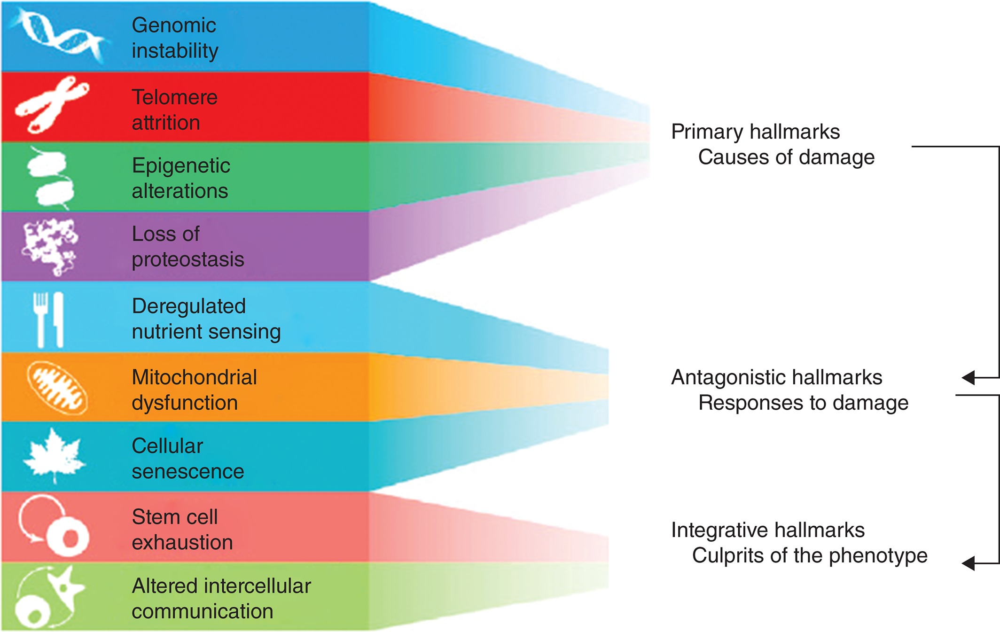
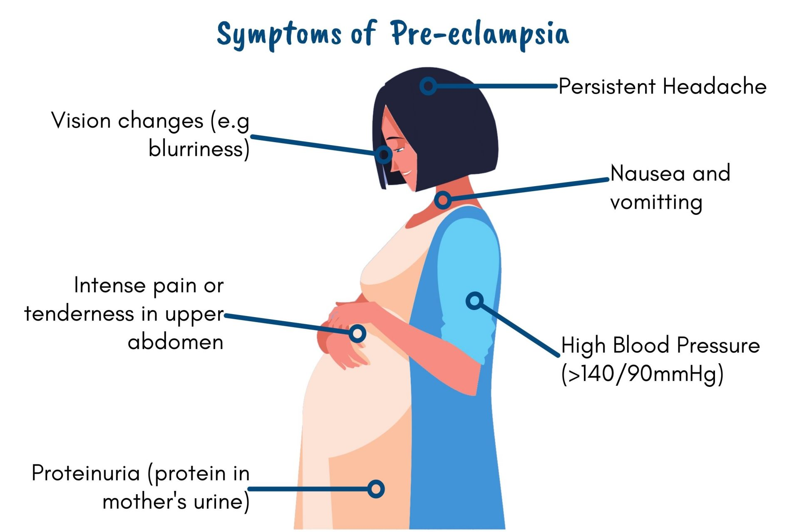

Shen Lab 的总体研究方向是开发用于多组学和可穿戴数据分析的生物信息学算法，并将这些方法应用于精准医学和重要生物学问题。

# 多组学与可穿戴数据的方法开发

## 质谱数据

质谱是测量离子质荷比的核心分析技术，可用于研究生物样本中的小分子、蛋白质、肽段、脂质和其他生物分子。我们关注质谱数据处理和分析中的生物信息学方法与算法开发，包括 LC-MS 数据处理流程、代谢网络分析，以及与转录组、蛋白组、微生物组等数据的整合。

## 微生物组数据

我们研究微生物组数据的统计建模、特征解释、跨身体部位关联，以及微生物组与代谢组之间的相互作用。重点问题包括如何从复杂、高维、异质的数据中得到可复现、可解释的生物学发现。

## 可穿戴数据

可穿戴设备提供连续、纵向、个体化的健康信息。我们关注如何将可穿戴数据与多组学数据整合，用于健康状态监测、疾病风险评估和个体化医学研究。

-----

# 多组学整合与健康应用

## 精准医学和生物学问题

我们希望通过多组学整合，把分子层面的变化与个体健康、疾病风险、生活方式和环境因素联系起来。

## 衰老

我们关注人类衰老过程中多组学分子的动态变化，以及如何用计算方法识别非线性变化、转折点和潜在机制。

## 妊娠

我们研究妊娠相关的代谢组、微生物组和其他组学变化，探索其与母婴健康、妊娠阶段和疾病风险之间的关系。

## 个人健康监测和疾病早期诊断

通过多组学、临床指标和可穿戴数据的整合，我们希望发展更早、更个体化、更可解释的健康监测方法。
